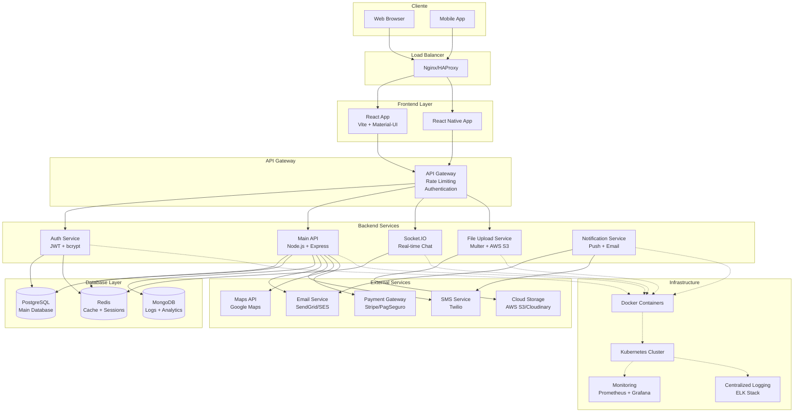
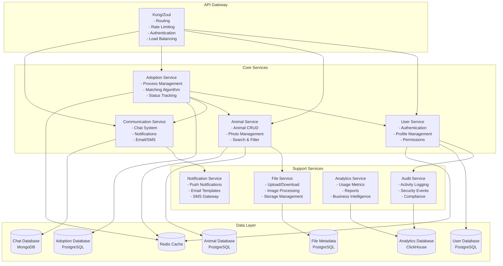
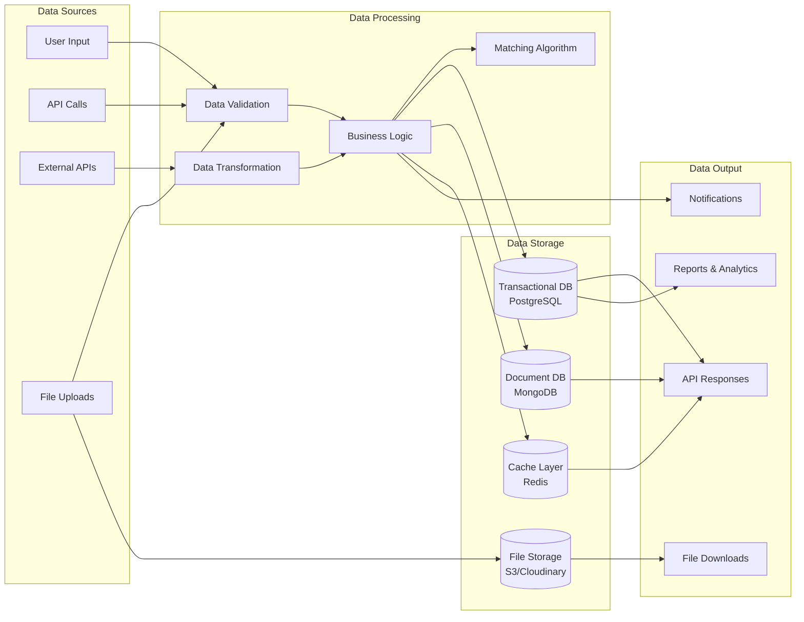
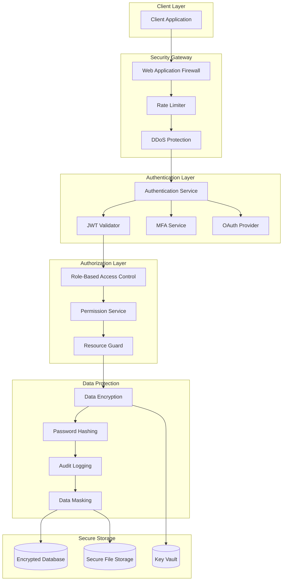
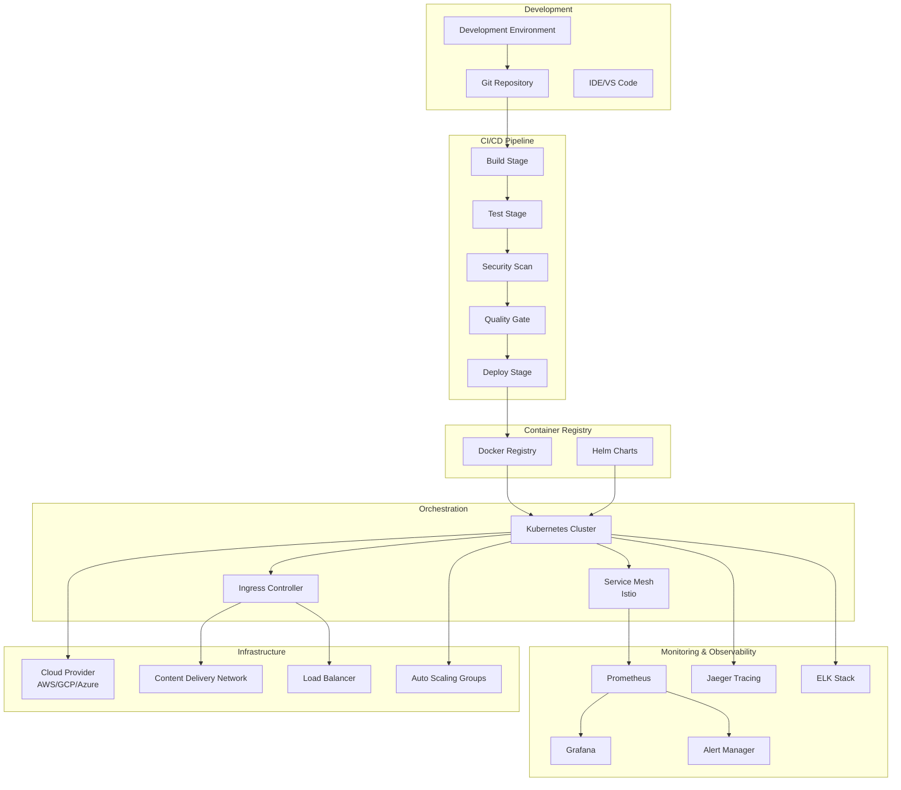

# Arquitetura do Sistema - Sistema de Adoção Responsável

## 1. Diagrama de Arquitetura Geral

## 2. Arquitetura de Microserviços

## 3. Fluxo de Dados

## 4. Segurança e Autenticação

## 5. Deployment e DevOps

## Tecnologias Utilizadas

### Frontend
- **React 18** - Framework principal
- **Vite** - Build tool e dev server
- **Material-UI** - Biblioteca de componentes
- **React Router** - Roteamento
- **Socket.IO Client** - Comunicação em tempo real

### Backend
- **Node.js** - Runtime JavaScript
- **Express.js** - Framework web
- **Socket.IO** - WebSocket para chat
- **JWT** - Autenticação
- **bcrypt** - Hash de senhas
- **Multer** - Upload de arquivos

### Database
- **PostgreSQL** - Banco principal
- **Redis** - Cache e sessões
- **MongoDB** - Logs e chat (opcional)

### DevOps
- **Docker** - Containerização
- **Docker Compose** - Orquestração local
- **Nginx** - Proxy reverso
- **Kubernetes** - Orquestração produção

### Monitoramento
- **Prometheus** - Métricas
- **Grafana** - Dashboards
- **ELK Stack** - Logs centralizados

### Segurança
- **Helmet** - Headers de segurança
- **CORS** - Cross-origin requests
- **Rate Limiting** - Controle de taxa
- **SSL/TLS** - Criptografia em trânsito