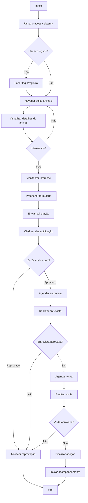
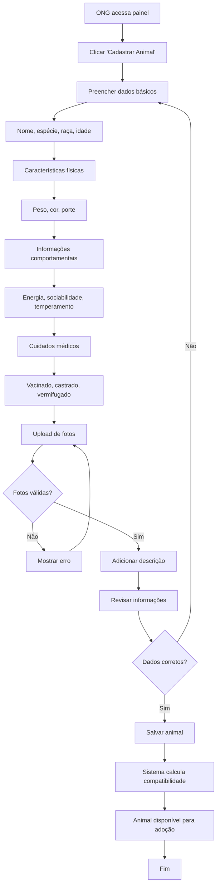
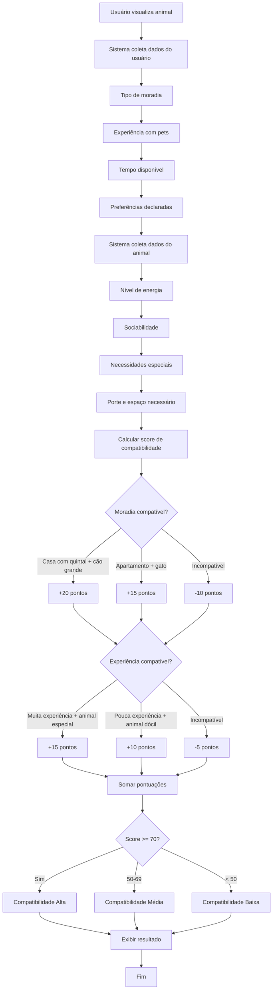
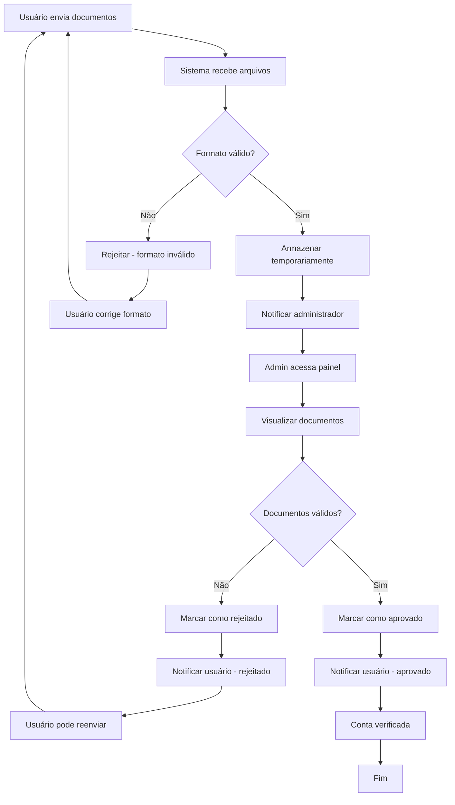
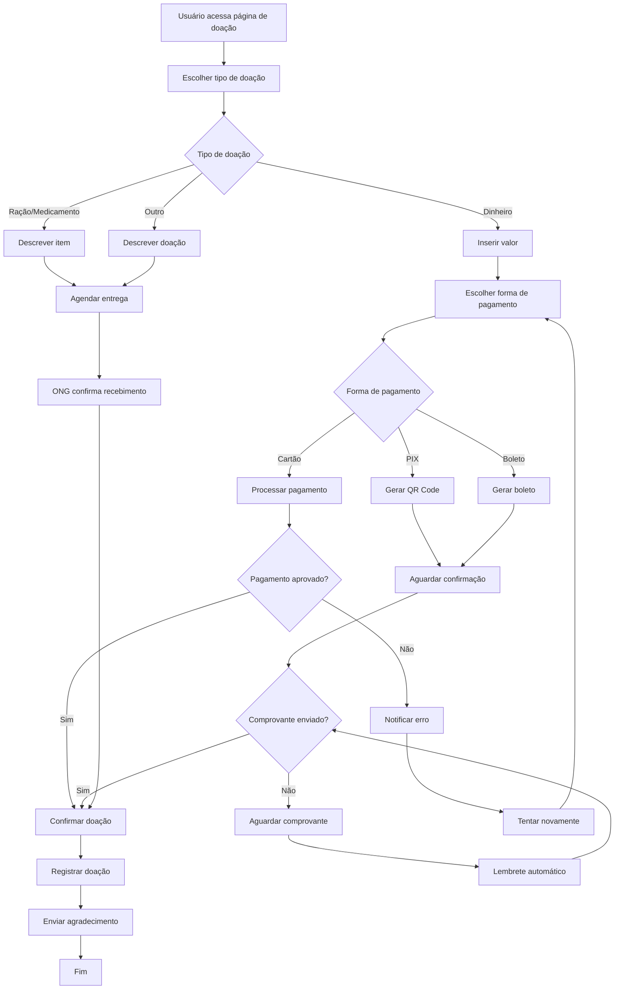
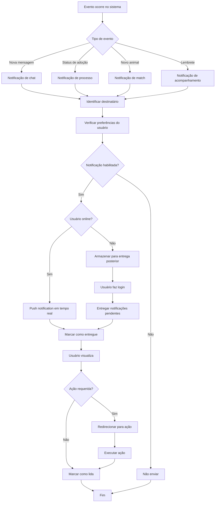

# Diagramas de Atividades - Sistema de Adoção Responsável

## 1. Fluxo de Adoção Completo

## 2. Processo de Cadastro de Animal

## 3. Sistema de Matching/Compatibilidade

## 4. Processo de Verificação de Documentos

## 5. Fluxo de Doação

## 6. Sistema de Notificações

