# Diagrama de Casos de Uso - Sistema de Adoção Responsável

```mermaid
graph TB
    %% Atores
    Adotante[👤 Adotante]
    ONG[🏢 ONG]
    Admin[👨‍💼 Administrador]
    Veterinario[👨‍⚕️ Veterinário]
    Sistema[🤖 Sistema]

    %% Casos de Uso - Autenticação
    subgraph "Autenticação e Perfil"
        UC01[Fazer Login]
        UC02[Registrar Conta]
        UC03[Editar Perfil]
        UC04[Recuperar Senha]
        UC05[Verificar Conta]
    end

    %% Casos de Uso - Animais
    subgraph "Gestão de Animais"
        UC06[Cadastrar Animal]
        UC07[Listar Animais]
        UC08[Visualizar Detalhes do Animal]
        UC09[Atualizar Status do Animal]
        UC10[Adicionar Fotos/Vídeos]
        UC11[Registrar Histórico Médico]
    end

    %% Casos de Uso - Adoção
    subgraph "Processo de Adoção"
        UC12[Manifestar Interesse]
        UC13[Favoritar Animal]
        UC14[Avaliar Compatibilidade]
        UC15[Iniciar Processo de Adoção]
        UC16[Agendar Entrevista]
        UC17[Agendar Visita]
        UC18[Aprovar/Reprovar Adoção]
        UC19[Finalizar Adoção]
        UC20[Acompanhar Pós-Adoção]
    end

    %% Casos de Uso - Comunicação
    subgraph "Comunicação"
        UC21[Enviar Mensagem]
        UC22[Receber Notificação]
        UC23[Chat em Tempo Real]
        UC24[Avaliar Experiência]
    end

    %% Casos de Uso - Gestão
    subgraph "Gestão e Administração"
        UC25[Gerenciar ONGs]
        UC26[Verificar Documentos]
        UC27[Gerar Relatórios]
        UC28[Moderar Conteúdo]
        UC29[Configurar Sistema]
    end

    %% Casos de Uso - Doações
    subgraph "Doações e Eventos"
        UC30[Fazer Doação]
        UC31[Organizar Evento]
        UC32[Participar de Feira de Adoção]
        UC33[Gerenciar Campanhas]
    end

    %% Relacionamentos Adotante
    Adotante --> UC01
    Adotante --> UC02
    Adotante --> UC03
    Adotante --> UC07
    Adotante --> UC08
    Adotante --> UC12
    Adotante --> UC13
    Adotante --> UC21
    Adotante --> UC22
    Adotante --> UC23
    Adotante --> UC24
    Adotante --> UC30
    Adotante --> UC32

    %% Relacionamentos ONG
    ONG --> UC01
    ONG --> UC02
    ONG --> UC03
    ONG --> UC06
    ONG --> UC07
    ONG --> UC08
    ONG --> UC09
    ONG --> UC10
    ONG --> UC11
    ONG --> UC15
    ONG --> UC16
    ONG --> UC17
    ONG --> UC18
    ONG --> UC19
    ONG --> UC20
    ONG --> UC21
    ONG --> UC22
    ONG --> UC23
    ONG --> UC24
    ONG --> UC27
    ONG --> UC31
    ONG --> UC32
    ONG --> UC33

    %% Relacionamentos Administrador
    Admin --> UC01
    Admin --> UC25
    Admin --> UC26
    Admin --> UC27
    Admin --> UC28
    Admin --> UC29
    Admin --> UC05

    %% Relacionamentos Veterinário
    Veterinario --> UC01
    Veterinario --> UC11
    Veterinario --> UC20

    %% Relacionamentos Sistema
    Sistema --> UC14
    Sistema --> UC22
    Sistema --> UC05

    %% Extensões e Inclusões
    UC12 -.->|extends| UC14
    UC15 -.->|includes| UC14
    UC18 -.->|includes| UC24
    UC19 -.->|includes| UC20
    UC21 -.->|includes| UC22
    UC06 -.->|includes| UC11

    %% Estilos
    classDef actor fill:#e1f5fe
    classDef usecase fill:#f3e5f5
    classDef system fill:#fff3e0

    class Adotante,ONG,Admin,Veterinario actor
    class UC01,UC02,UC03,UC04,UC05,UC06,UC07,UC08,UC09,UC10,UC11,UC12,UC13,UC14,UC15,UC16,UC17,UC18,UC19,UC20,UC21,UC22,UC23,UC24,UC25,UC26,UC27,UC28,UC29,UC30,UC31,UC32,UC33 usecase
    class Sistema system
```

## Descrição dos Casos de Uso

### Autenticação e Perfil
- **UC01 - Fazer Login**: Usuário autentica no sistema
- **UC02 - Registrar Conta**: Novo usuário cria conta
- **UC03 - Editar Perfil**: Usuário atualiza informações pessoais
- **UC04 - Recuperar Senha**: Usuário recupera acesso à conta
- **UC05 - Verificar Conta**: Sistema valida documentos do usuário

### Gestão de Animais
- **UC06 - Cadastrar Animal**: ONG adiciona novo animal
- **UC07 - Listar Animais**: Visualizar animais disponíveis
- **UC08 - Visualizar Detalhes**: Ver informações completas do animal
- **UC09 - Atualizar Status**: Alterar disponibilidade do animal
- **UC10 - Adicionar Mídia**: Upload de fotos e vídeos
- **UC11 - Registrar Histórico Médico**: Documentar cuidados veterinários

### Processo de Adoção
- **UC12 - Manifestar Interesse**: Adotante demonstra interesse
- **UC13 - Favoritar Animal**: Salvar animal como favorito
- **UC14 - Avaliar Compatibilidade**: Sistema calcula match
- **UC15 - Iniciar Processo**: Começar tramitação de adoção
- **UC16 - Agendar Entrevista**: Marcar conversa com adotante
- **UC17 - Agendar Visita**: Marcar visita ao animal
- **UC18 - Aprovar/Reprovar**: Decisão sobre adoção
- **UC19 - Finalizar Adoção**: Concluir processo
- **UC20 - Acompanhar Pós-Adoção**: Monitorar bem-estar

### Comunicação
- **UC21 - Enviar Mensagem**: Comunicação entre usuários
- **UC22 - Receber Notificação**: Alertas do sistema
- **UC23 - Chat em Tempo Real**: Conversa instantânea
- **UC24 - Avaliar Experiência**: Feedback sobre processo

### Gestão e Administração
- **UC25 - Gerenciar ONGs**: Administrar organizações
- **UC26 - Verificar Documentos**: Validar documentação
- **UC27 - Gerar Relatórios**: Criar relatórios estatísticos
- **UC28 - Moderar Conteúdo**: Controlar publicações
- **UC29 - Configurar Sistema**: Ajustar parâmetros

### Doações e Eventos
- **UC30 - Fazer Doação**: Contribuir financeiramente
- **UC31 - Organizar Evento**: Criar eventos de adoção
- **UC32 - Participar de Feira**: Eventos presenciais
- **UC33 - Gerenciar Campanhas**: Coordenar campanhas