# Diagrama Entidade-Relacionamento (DER) - Sistema de Adoção Responsável

```mermaid
erDiagram
    USUARIOS {
        int id PK
        string nome
        string email UK
        string senha
        string telefone
        string tipo_usuario
        string endereco
        string cidade
        string estado
        string cep
        decimal latitude
        decimal longitude
        string tipo_moradia
        string tamanho_moradia
        boolean tem_quintal
        string experiencia_pets
        string tempo_disponivel
        decimal renda_familiar
        text motivacao_adocao
        jsonb preferencias_animal
        boolean ativo
        boolean verificado
        boolean mfa_habilitado
        string mfa_secret
        timestamp created_at
        timestamp updated_at
    }

    ONGS {
        int id PK
        int usuario_id FK
        string nome_fantasia
        string razao_social
        string cnpj UK
        text descricao
        string site
        string instagram
        string facebook
        string telefone_principal
        string telefone_secundario
        string email_contato
        text endereco
        string cidade
        string estado
        string cep
        int capacidade_maxima
        int animais_atuais
        int total_adocoes
        boolean verificada
        boolean ativa
        timestamp created_at
        timestamp updated_at
    }

    ANIMAIS {
        int id PK
        string nome
        string especie
        string raca
        int idade
        string sexo
        string porte
        decimal peso
        string cor
        text descricao
        text personalidade
        string nivel_energia
        string sociabilidade
        string temperamento
        boolean cuidados_especiais
        text necessidades_especiais
        boolean castrado
        boolean vacinado
        boolean vermifugado
        boolean microchip
        text observacoes_medicas
        int ong_id FK
        int adotante_id FK
        jsonb fotos
        jsonb videos
        string status
        date data_entrada
        date data_adocao
        timestamp created_at
        timestamp updated_at
    }

    PROCESSOS_ADOCAO {
        int id PK
        int animal_id FK
        int adotante_id FK
        int ong_id FK
        string status
        date data_inicio
        date data_finalizacao
        text observacoes
        text motivo_reprovacao
        jsonb documentos_enviados
        boolean documentos_aprovados
        timestamp data_entrevista
        timestamp data_visita
        int score_compatibilidade
        text avaliacao_ong
        text mensagem
        timestamp created_at
        timestamp updated_at
    }

    FAVORITOS {
        int id PK
        int usuario_id FK
        int animal_id FK
        timestamp created_at
    }

    ACOMPANHAMENTOS {
        int id PK
        int processo_adocao_id FK
        int animal_id FK
        int adotante_id FK
        int ong_id FK
        string tipo_acompanhamento
        date data_acompanhamento
        text observacoes
        boolean animal_adaptado
        text problemas_reportados
        boolean necessita_intervencao
        jsonb fotos
        jsonb videos
        timestamp created_at
    }

    HISTORICO_MEDICO {
        int id PK
        int animal_id FK
        int veterinario_id FK
        string tipo_procedimento
        date data_procedimento
        string veterinario
        string clinica
        text observacoes
        text medicamentos
        date proximo_agendamento
        jsonb receitas
        jsonb exames
        timestamp created_at
    }

    MENSAGENS {
        int id PK
        int remetente_id FK
        int destinatario_id FK
        int processo_adocao_id FK
        text conteudo
        string tipo_mensagem
        string arquivo_url
        boolean lida
        timestamp data_leitura
        timestamp created_at
    }

    AVALIACOES {
        int id PK
        int processo_adocao_id FK
        int avaliador_id FK
        int avaliado_id FK
        int nota
        text comentario
        text aspectos_positivos
        text aspectos_negativos
        boolean recomendaria
        timestamp created_at
    }

    EVENTOS {
        int id PK
        string titulo
        text descricao
        string tipo_evento
        int organizador_id FK
        jsonb participantes
        timestamp data_inicio
        timestamp data_fim
        string local
        text endereco
        string status
        timestamp created_at
        timestamp updated_at
    }

    DOACOES {
        int id PK
        int doador_id FK
        int ong_id FK
        string tipo_doacao
        decimal valor
        text descricao
        string status
        date data_doacao
        string forma_pagamento
        string comprovante_url
        timestamp created_at
    }

    %% Relacionamentos
    USUARIOS ||--o{ ONGS : "pode_ser"
    USUARIOS ||--o{ ANIMAIS : "adota"
    USUARIOS ||--o{ PROCESSOS_ADOCAO : "participa_como_adotante"
    USUARIOS ||--o{ FAVORITOS : "tem"
    USUARIOS ||--o{ MENSAGENS : "envia"
    USUARIOS ||--o{ MENSAGENS : "recebe"
    USUARIOS ||--o{ AVALIACOES : "avalia"
    USUARIOS ||--o{ AVALIACOES : "e_avaliado"
    USUARIOS ||--o{ EVENTOS : "organiza"
    USUARIOS ||--o{ DOACOES : "faz"
    USUARIOS ||--o{ HISTORICO_MEDICO : "veterinario_registra"
    USUARIOS ||--o{ ACOMPANHAMENTOS : "participa"

    ONGS ||--o{ ANIMAIS : "cuida"
    ONGS ||--o{ PROCESSOS_ADOCAO : "gerencia"
    ONGS ||--o{ DOACOES : "recebe"
    ONGS ||--o{ ACOMPANHAMENTOS : "realiza"

    ANIMAIS ||--o{ PROCESSOS_ADOCAO : "esta_em"
    ANIMAIS ||--o{ FAVORITOS : "e_favoritado"
    ANIMAIS ||--o{ HISTORICO_MEDICO : "tem"
    ANIMAIS ||--o{ ACOMPANHAMENTOS : "e_acompanhado"

    PROCESSOS_ADOCAO ||--o{ MENSAGENS : "gera"
    PROCESSOS_ADOCAO ||--o{ AVALIACOES : "resulta_em"
    PROCESSOS_ADOCAO ||--o{ ACOMPANHAMENTOS : "gera"
```

## Descrição das Entidades

### USUARIOS
Entidade central que representa todos os usuários do sistema (adotantes, ONGs, administradores, veterinários).

**Atributos principais:**
- `tipo_usuario`: Define o papel (adotante, ong, admin)
- `preferencias_animal`: JSON com preferências de adoção
- `experiencia_pets`: Nível de experiência com animais
- `verificado`: Status de verificação da conta

### ONGS
Organizações responsáveis pelos animais disponíveis para adoção.

**Atributos principais:**
- `cnpj`: Identificação única da organização
- `capacidade_maxima`: Limite de animais que pode abrigar
- `total_adocoes`: Contador de adoções realizadas
- `verificada`: Status de verificação da ONG

### ANIMAIS
Representa os animais disponíveis para adoção.

**Atributos principais:**
- `especie`: Cão, gato ou outro
- `status`: disponivel, em_processo, adotado, indisponivel
- `fotos`: Array JSON com URLs das imagens
- `cuidados_especiais`: Indica necessidades médicas especiais

### PROCESSOS_ADOCAO
Controla todo o fluxo de adoção desde o interesse até a finalização.

**Atributos principais:**
- `status`: Estados do processo (iniciado, aprovado, reprovado, etc.)
- `score_compatibilidade`: Pontuação de match calculada
- `documentos_enviados`: JSON com documentos do processo

### FAVORITOS
Relacionamento simples entre usuários e animais favoritados.

### ACOMPANHAMENTOS
Registra o acompanhamento pós-adoção para garantir o bem-estar animal.

**Atributos principais:**
- `tipo_acompanhamento`: ligacao, visita, questionario, foto, video
- `animal_adaptado`: Status de adaptação
- `necessita_intervencao`: Flag para casos que precisam de atenção

### HISTORICO_MEDICO
Mantém registro completo dos cuidados veterinários de cada animal.

### MENSAGENS
Sistema de comunicação entre usuários durante o processo de adoção.

### AVALIACOES
Feedback sobre o processo de adoção e experiência dos usuários.

### EVENTOS
Eventos organizados pelas ONGs (feiras de adoção, campanhas, etc.).

### DOACOES
Registro de doações financeiras e materiais para as ONGs.

## Relacionamentos Principais

1. **Usuario → ONG** (1:N): Um usuário pode ser responsável por uma ONG
2. **ONG → Animal** (1:N): Uma ONG cuida de vários animais
3. **Usuario → Favorito → Animal** (N:N): Usuários podem favoritar vários animais
4. **Usuario → ProcessoAdocao ← Animal** (N:N): Relacionamento de adoção
5. **ProcessoAdocao → Acompanhamento** (1:N): Processo gera acompanhamentos
6. **Animal → HistoricoMedico** (1:N): Animal tem histórico médico
7. **Usuario → Mensagem ← Usuario** (N:N): Comunicação entre usuários