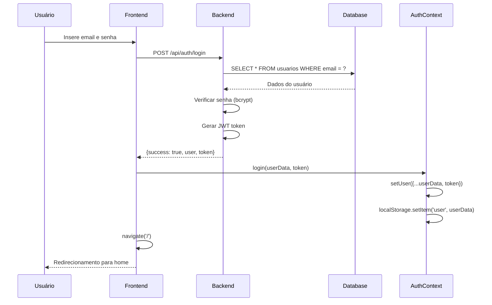
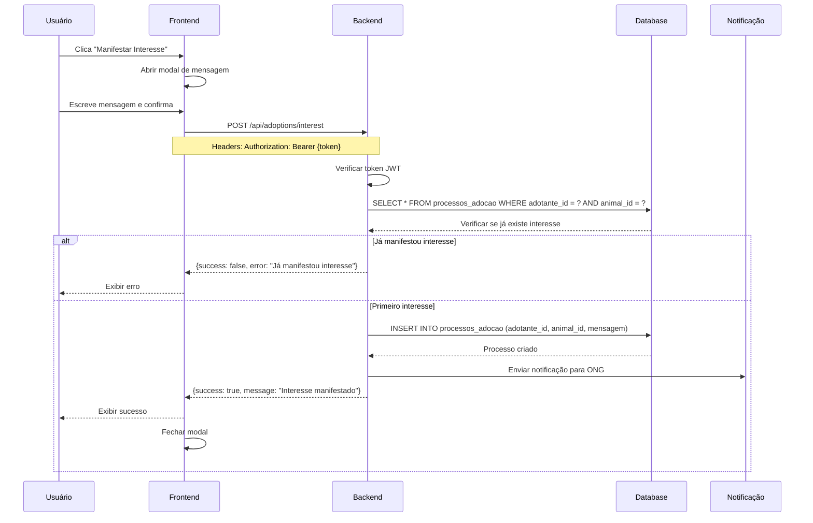
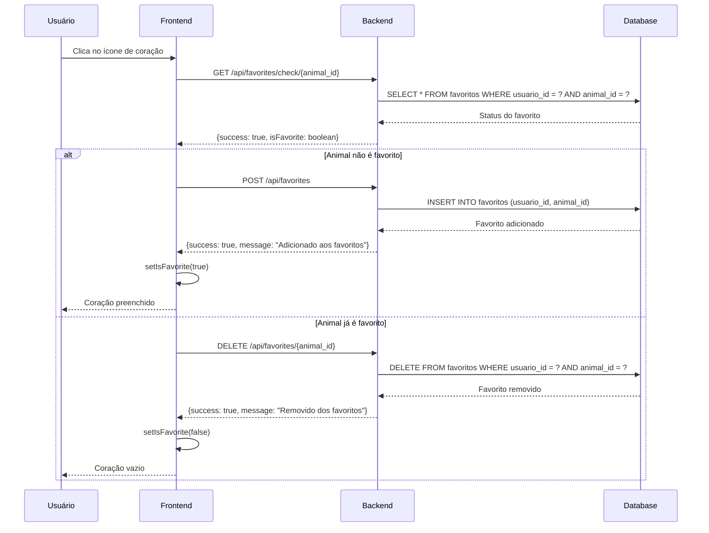
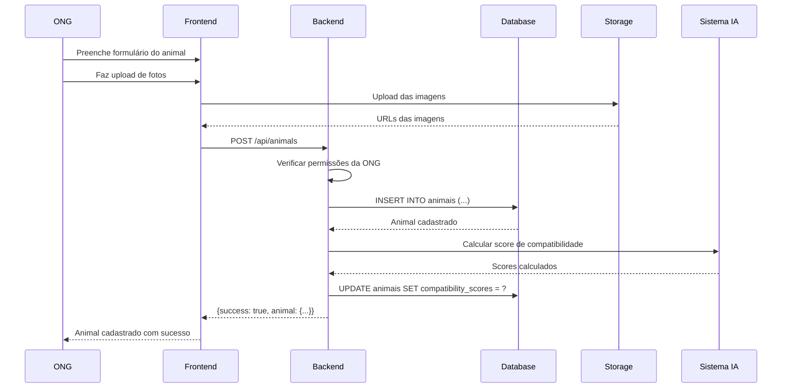
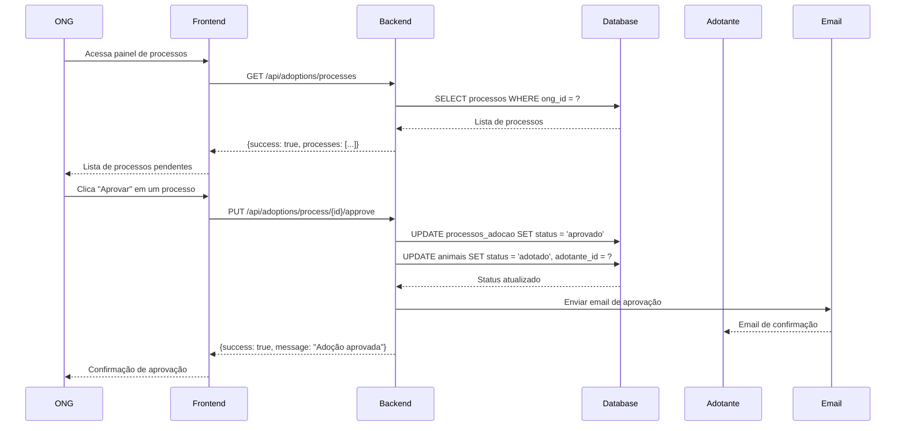
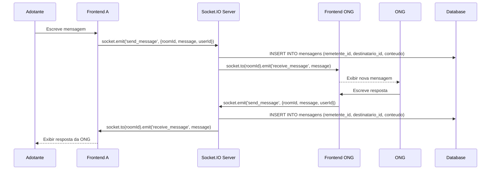
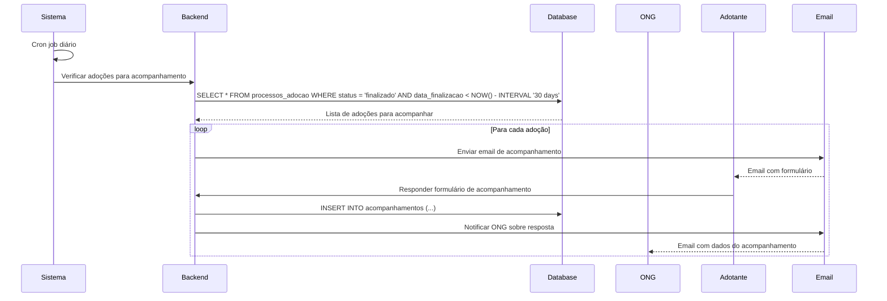

# Diagramas de Sequência - Sistema de Adoção Responsável

## 1. Processo de Login

## 2. Processo de Manifestar Interesse

## 3. Processo de Favoritar Animal

## 4. Processo de Cadastro de Animal (ONG)

## 5. Processo de Aprovação de Adoção

## 6. Sistema de Chat em Tempo Real

## 7. Processo de Acompanhamento Pós-Adoção

