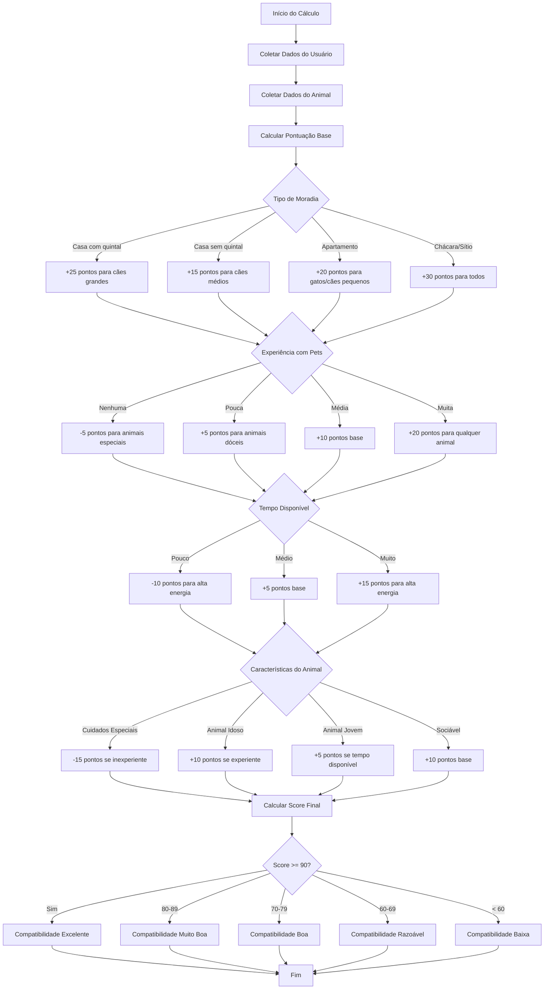
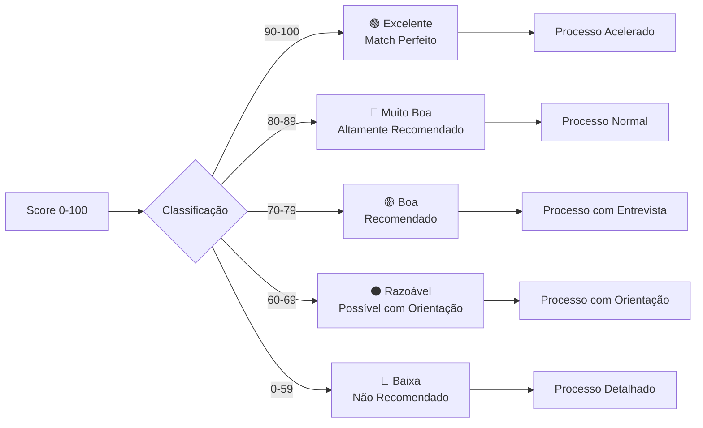
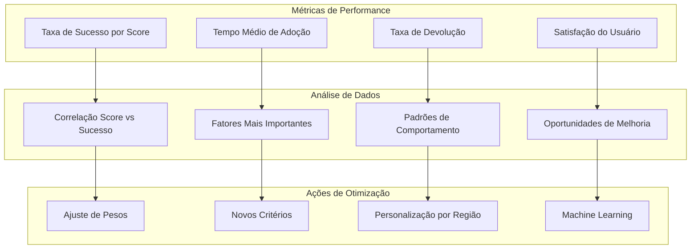

# Sistema de Pontuação e Compatibilidade - Adoção Responsável

## 1. Algoritmo de Matching



## 2. Matriz de Compatibilidade

### Tabela de Pontuação por Categoria

| Categoria | Critério | Animal | Pontos |
|-----------|----------|---------|---------|
| **Moradia** | Casa com quintal | Cão grande/gigante | +25 |
| | Casa com quintal | Cão médio | +20 |
| | Casa com quintal | Cão pequeno/gato | +15 |
| | Casa sem quintal | Cão médio | +15 |
| | Casa sem quintal | Cão pequeno | +10 |
| | Apartamento | Gato | +20 |
| | Apartamento | Cão pequeno | +15 |
| | Apartamento | Cão médio/grande | -10 |
| | Chácara/Sítio | Qualquer | +30 |

| **Experiência** | Nenhuma | Animal com necessidades especiais | -15 |
| | Nenhuma | Animal dócil e saudável | +5 |
| | Pouca | Animal dócil | +10 |
| | Pouca | Animal com temperamento forte | -5 |
| | Média | Qualquer animal | +15 |
| | Muita | Animal com necessidades especiais | +25 |
| | Muita | Qualquer animal | +20 |

| **Tempo Disponível** | Pouco | Alta energia | -15 |
| | Pouco | Baixa energia | +5 |
| | Médio | Média energia | +10 |
| | Médio | Alta energia | +5 |
| | Muito | Alta energia | +20 |
| | Muito | Qualquer | +15 |

| **Características** | Castrado | Qualquer | +10 |
| | Vacinado | Qualquer | +10 |
| | Microchip | Qualquer | +5 |
| | Idoso (>7 anos) | Experiência média/alta | +15 |
| | Filhote (<1 ano) | Tempo disponível médio/alto | +10 |
| | Necessidades especiais | Experiência alta | +10 |
| | Necessidades especiais | Experiência baixa | -20 |

## 3. Algoritmo de Implementação

```javascript
function calcularCompatibilidade(usuario, animal) {
    let score = 50; // Pontuação base
    
    // Avaliação de moradia
    score += avaliarMoradia(usuario.tipo_moradia, usuario.tem_quintal, animal);
    
    // Avaliação de experiência
    score += avaliarExperiencia(usuario.experiencia_pets, animal);
    
    // Avaliação de tempo disponível
    score += avaliarTempoDisponivel(usuario.tempo_disponivel, animal);
    
    // Características do animal
    score += avaliarCaracteristicasAnimal(animal);
    
    // Preferências específicas do usuário
    score += avaliarPreferencias(usuario.preferencias_animal, animal);
    
    // Fatores geográficos
    score += avaliarDistancia(usuario, animal.ong);
    
    // Garantir que o score está entre 0 e 100
    return Math.max(0, Math.min(100, score));
}

function avaliarMoradia(tipoMoradia, temQuintal, animal) {
    let pontos = 0;
    
    switch(tipoMoradia) {
        case 'casa':
            if (temQuintal) {
                if (animal.porte === 'grande' || animal.porte === 'gigante') {
                    pontos += 25;
                } else if (animal.porte === 'medio') {
                    pontos += 20;
                } else {
                    pontos += 15;
                }
            } else {
                if (animal.porte === 'medio') {
                    pontos += 15;
                } else if (animal.porte === 'pequeno') {
                    pontos += 10;
                } else {
                    pontos -= 5; // Cão grande sem quintal
                }
            }
            break;
            
        case 'apartamento':
            if (animal.especie === 'gato') {
                pontos += 20;
            } else if (animal.porte === 'pequeno') {
                pontos += 15;
            } else {
                pontos -= 10; // Cão médio/grande em apartamento
            }
            break;
            
        case 'chacara':
            pontos += 30; // Ideal para qualquer animal
            break;
    }
    
    return pontos;
}

function avaliarExperiencia(experiencia, animal) {
    let pontos = 0;
    const temNecessidadesEspeciais = animal.cuidados_especiais || 
                                   animal.observacoes_medicas || 
                                   animal.idade > 84; // > 7 anos
    
    switch(experiencia) {
        case 'nenhuma':
            if (temNecessidadesEspeciais) {
                pontos -= 15;
            } else if (animal.temperamento === 'docil') {
                pontos += 5;
            }
            break;
            
        case 'pouca':
            if (animal.temperamento === 'docil') {
                pontos += 10;
            } else if (animal.temperamento === 'protetor' || animal.temperamento === 'independente') {
                pontos -= 5;
            }
            break;
            
        case 'media':
            pontos += 15;
            break;
            
        case 'muita':
            if (temNecessidadesEspeciais) {
                pontos += 25;
            } else {
                pontos += 20;
            }
            break;
    }
    
    return pontos;
}

function avaliarTempoDisponivel(tempoDisponivel, animal) {
    let pontos = 0;
    
    switch(tempoDisponivel) {
        case 'pouco':
            if (animal.nivel_energia === 'alto' || animal.nivel_energia === 'muito_alto') {
                pontos -= 15;
            } else if (animal.nivel_energia === 'baixo') {
                pontos += 5;
            }
            break;
            
        case 'medio':
            if (animal.nivel_energia === 'medio') {
                pontos += 10;
            } else if (animal.nivel_energia === 'alto') {
                pontos += 5;
            }
            break;
            
        case 'muito':
            if (animal.nivel_energia === 'alto' || animal.nivel_energia === 'muito_alto') {
                pontos += 20;
            } else {
                pontos += 15;
            }
            break;
    }
    
    return pontos;
}

function avaliarCaracteristicasAnimal(animal) {
    let pontos = 0;
    
    // Cuidados veterinários
    if (animal.castrado) pontos += 10;
    if (animal.vacinado) pontos += 10;
    if (animal.vermifugado) pontos += 5;
    if (animal.microchip) pontos += 5;
    
    // Idade
    if (animal.idade > 84) { // Idoso
        pontos += 10; // Animais idosos precisam de lares especiais
    } else if (animal.idade < 12) { // Filhote
        pontos += 5; // Filhotes são mais adaptáveis
    }
    
    // Sociabilidade
    if (animal.sociabilidade === 'alta') {
        pontos += 10;
    } else if (animal.sociabilidade === 'baixa') {
        pontos -= 5;
    }
    
    return pontos;
}
```

## 4. Classificação de Compatibilidade

### Níveis de Compatibilidade



### Descrição dos Níveis

#### 🟢 Excelente (90-100 pontos)
- **Características**: Match quase perfeito entre adotante e animal
- **Processo**: Pode ser acelerado com menos etapas
- **Recomendação**: Fortemente recomendado
- **Acompanhamento**: Padrão

#### 🔵 Muito Boa (80-89 pontos)
- **Características**: Excelente compatibilidade com pequenos ajustes
- **Processo**: Processo normal de adoção
- **Recomendação**: Altamente recomendado
- **Acompanhamento**: Padrão

#### 🟡 Boa (70-79 pontos)
- **Características**: Boa compatibilidade, alguns pontos de atenção
- **Processo**: Entrevista obrigatória para esclarecer pontos
- **Recomendação**: Recomendado com orientações
- **Acompanhamento**: Intensificado nos primeiros meses

#### 🟠 Razoável (60-69 pontos)
- **Características**: Compatibilidade moderada, necessita orientação
- **Processo**: Processo detalhado com orientações específicas
- **Recomendação**: Possível com acompanhamento próximo
- **Acompanhamento**: Intensivo e prolongado

#### 🔴 Baixa (0-59 pontos)
- **Características**: Baixa compatibilidade, muitos fatores de risco
- **Processo**: Processo muito detalhado, pode ser desencorajado
- **Recomendação**: Não recomendado, sugerir outros animais
- **Acompanhamento**: Muito intensivo se aprovado

## 5. Fatores de Ajuste Dinâmico

### Ajustes Baseados em Contexto

```javascript
function aplicarAjustesDinamicos(scoreBase, contexto) {
    let scoreAjustado = scoreBase;
    
    // Urgência de adoção
    if (contexto.animal.tempo_no_abrigo > 365) { // Mais de 1 ano
        scoreAjustado += 5; // Incentivo para animais há muito tempo no abrigo
    }
    
    // Sazonalidade
    if (contexto.mes === 'dezembro') { // Campanha de fim de ano
        scoreAjustado += 3;
    }
    
    // Capacidade da ONG
    if (contexto.ong.ocupacao > 0.9) { // ONG com mais de 90% da capacidade
        scoreAjustado += 5;
    }
    
    // Histórico do adotante
    if (contexto.usuario.adocoes_anteriores > 0) {
        scoreAjustado += 10; // Experiência prévia positiva
    }
    
    // Distância geográfica
    if (contexto.distancia_km > 50) {
        scoreAjustado -= 5; // Penalidade por distância
    }
    
    return Math.max(0, Math.min(100, scoreAjustado));
}
```

## 6. Métricas e Análise

### KPIs do Sistema de Matching

- **Taxa de Sucesso**: % de adoções finalizadas por nível de compatibilidade
- **Tempo Médio de Adoção**: Por nível de compatibilidade
- **Taxa de Devolução**: % de animais devolvidos por nível
- **Satisfação do Adotante**: Avaliação pós-adoção
- **Precisão do Algoritmo**: Correlação entre score e sucesso real

### Dashboard de Monitoramento

