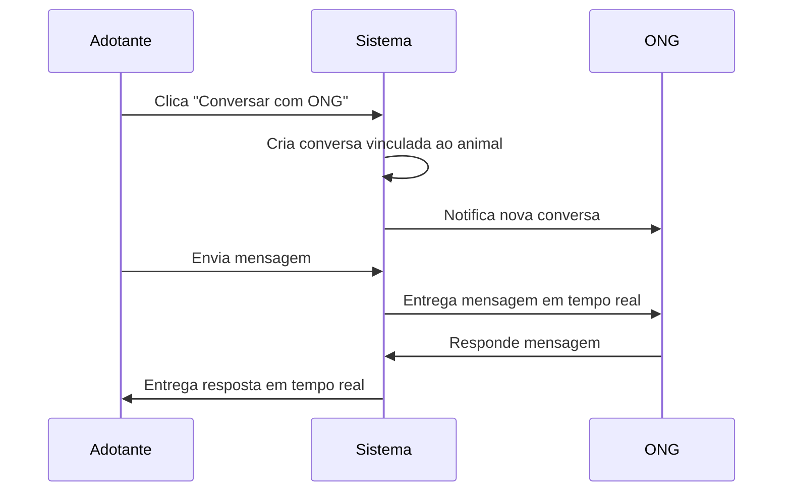

# Sistema de Chat - Conexão entre Adotantes e ONGs

## 📋 Visão Geral

O sistema de chat permite a comunicação direta entre usuários adotantes e ONGs responsáveis pelos animais, facilitando o processo de adoção através de conversas em tempo real sobre animais específicos.

## 🔧 Funcionalidades Implementadas

### 1. **Início de Conversa**
- **Botão "Conversar com ONG"** na página de detalhes do animal
- **Botão "💬 Chat"** na lista de animais para início rápido
- **Integração automática** ao manifestar interesse em adoção

### 2. **Interface de Chat**
- Lista de conversas organizadas por animal
- Visualização de mensagens em tempo real
- Indicadores de mensagens não lidas
- Interface responsiva e intuitiva

### 3. **Recursos de Comunicação**
- Mensagens de texto em tempo real via Socket.IO
- Marcação automática de mensagens como lidas
- Histórico completo de conversas
- Informações contextuais do animal na conversa

## 🏗️ Arquitetura Técnica

### Backend (Node.js + Socket.IO)
```
/api/chat/
├── POST /start          # Iniciar nova conversa
├── GET /conversations   # Listar conversas do usuário
├── GET /messages/:id    # Obter mensagens de uma conversa
├── POST /send          # Enviar nova mensagem
└── PUT /mark-read      # Marcar mensagens como lidas
```

### Frontend (React + Socket.IO Client)
```
/src/pages/
├── Chat.jsx           # Interface principal do chat
├── AnimalDetail.jsx   # Botão "Conversar com ONG"
└── Animals.jsx        # Botão de chat rápido na lista
```

### Banco de Dados (PostgreSQL)
```sql
-- Tabela de mensagens com referência ao animal
CREATE TABLE mensagens (
    id SERIAL PRIMARY KEY,
    remetente_id INTEGER REFERENCES usuarios(id),
    destinatario_id INTEGER REFERENCES usuarios(id),
    animal_id INTEGER REFERENCES animais(id),
    conteudo TEXT NOT NULL,
    tipo_mensagem VARCHAR(20) DEFAULT 'texto',
    lida BOOLEAN DEFAULT FALSE,
    created_at TIMESTAMP DEFAULT NOW()
);
```

## 🚀 Como Usar

### Para Adotantes:
1. **Navegue** até a página de animais
2. **Clique** em "💬 Chat" na lista ou "Conversar com ONG" nos detalhes
3. **Digite** sua mensagem inicial
4. **Acompanhe** a conversa na página de Chat

### Para ONGs:
1. **Acesse** o menu "💬 Chat" no navbar
2. **Visualize** todas as conversas sobre seus animais
3. **Responda** às mensagens dos interessados
4. **Gerencie** múltiplas conversas simultaneamente

## 🔄 Fluxo de Comunicação



## 📱 Recursos da Interface

### Lista de Conversas
- **Avatar** do participante com badge de mensagens não lidas
- **Nome** do animal em destaque
- **Prévia** da última mensagem
- **Timestamp** da última atividade

### Área de Chat
- **Header** com informações do participante e animal
- **Mensagens** organizadas cronologicamente
- **Indicadores** de status (enviado/lido)
- **Campo** de entrada com suporte a Enter para envio

### Notificações
- **Badges** visuais para mensagens não lidas
- **Alertas** de sucesso/erro nas ações
- **Feedback** visual em tempo real

## 🔐 Segurança e Validações

- **Autenticação** obrigatória para usar o chat
- **Autorização** baseada no tipo de usuário
- **Validação** de propriedade do animal (ONG)
- **Sanitização** de mensagens
- **Rate limiting** para prevenir spam

## 🎯 Benefícios do Sistema

### Para Adotantes:
- Comunicação direta com a ONG responsável
- Esclarecimento de dúvidas sobre o animal
- Acompanhamento do processo de adoção
- Histórico de conversas preservado

### Para ONGs:
- Gestão centralizada de interessados
- Comunicação eficiente com múltiplos adotantes
- Contexto completo sobre cada animal
- Redução de ligações telefônicas

## 🔧 Configurações Técnicas

### Socket.IO
```javascript
// Configuração do servidor
const io = socketIo(server, {
  cors: {
    origin: process.env.FRONTEND_URL || "http://localhost:3000",
    methods: ["GET", "POST"]
  }
});

// Salas de chat organizadas por participantes e animal
const roomId = `chat_${userId1}_${userId2}_${animalId}`;
```

### Estrutura de Mensagens
```javascript
{
  id: number,
  remetente_id: number,
  destinatario_id: number,
  animal_id: number,
  conteudo: string,
  sender_name: string,
  created_at: timestamp,
  lida: boolean
}
```

## 📈 Métricas e Monitoramento

- **Número** de conversas iniciadas por animal
- **Taxa** de resposta das ONGs
- **Tempo** médio de resposta
- **Conversões** de chat para adoção
- **Satisfação** dos usuários

## 🔮 Futuras Melhorias

- [ ] Envio de imagens e arquivos
- [ ] Notificações push
- [ ] Chat em grupo (ONG + múltiplos interessados)
- [ ] Integração com WhatsApp
- [ ] Tradução automática de mensagens
- [ ] Chatbot para perguntas frequentes
- [ ] Videochamadas integradas
- [ ] Agendamento de visitas via chat

## 🐛 Troubleshooting

### Problemas Comuns:
1. **Mensagens não chegam**: Verificar conexão Socket.IO
2. **Conversa não inicia**: Validar autenticação do usuário
3. **Mensagens duplicadas**: Verificar listeners do Socket.IO
4. **Performance lenta**: Otimizar queries do banco de dados

### Logs Importantes:
```bash
# Conexões Socket.IO
console.log('Usuário conectado:', socket.id);

# Mensagens enviadas
console.log(`Mensagem enviada na sala ${roomId}`);

# Erros de chat
console.error('Erro ao iniciar conversa:', error);
```

---

**Desenvolvido com ❤️ para conectar animais e famílias através da tecnologia**